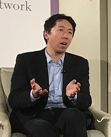

<table class="infobox biography vcard">
<tbody>
<tr>
<th colspan="2">

Andrew Ng

</th>
</tr>
<tr>
<td colspan="2"></td>
</tr>
<tr>
<th scope="row">Born</th>
<td>

Andrew Yan-Tak Ng

 April 18, 1976&nbsp;(age&nbsp;44) 

United Kingdom

</td>
</tr>
<tr>
<th scope="row">Nationality</th>
<td class="category"><a title="United States" href="https://en.wikipedia.org/wiki/United_States">United States</a></td>
</tr>
<tr>
<th scope="row">Alma&nbsp;mater</th>
<td><a title="University of California, Berkeley" href="https://en.wikipedia.org/wiki/University_of_California,_Berkeley">University of California, Berkeley</a>&nbsp;(PhD) <a title="Massachusetts Institute of Technology" href="https://en.wikipedia.org/wiki/Massachusetts_Institute_of_Technology">Massachusetts Institute of Technology</a>&nbsp;(MS) <a title="Carnegie Mellon University" href="https://en.wikipedia.org/wiki/Carnegie_Mellon_University">Carnegie Mellon University</a>&nbsp;(BS) <a title="Raffles Institution" href="https://en.wikipedia.org/wiki/Raffles_Institution">Raffles Institution</a>&nbsp;(High School)</td>
</tr>
<tr>
<th scope="row">Known&nbsp;for</th>
<td><a class="mw-redirect" title="Artificial Intelligence" href="https://en.wikipedia.org/wiki/Artificial_Intelligence">Artificial Intelligence</a>,&nbsp;<a class="mw-redirect" title="Deep Learning" href="https://en.wikipedia.org/wiki/Deep_Learning">Deep Learning</a>,&nbsp;<a class="mw-redirect" title="MOOC" href="https://en.wikipedia.org/wiki/MOOC">MOOC</a>,&nbsp;<a class="mw-redirect" title="Education technology" href="https://en.wikipedia.org/wiki/Education_technology">Education technology</a></td>
</tr>
<tr>
<th scope="row">Spouse(s)</th>
<td><a title="Carol E. Reiley" href="https://en.wikipedia.org/wiki/Carol_E._Reiley">Carol E. Reiley</a></td>
</tr>
<tr>
<th scope="row">Children</th>
<td>1</td>
</tr>
<tr>
<th scope="row">Awards</th>
<td>2007&nbsp;<a class="mw-redirect" title="Sloan Fellowship" href="https://en.wikipedia.org/wiki/Sloan_Fellowship">Sloan Fellowship</a>,

2008.&nbsp;<a title="MIT Technology Review" href="https://en.wikipedia.org/wiki/MIT_Technology_Review">MIT Technology Review</a>&nbsp;<a class="mw-redirect" title="TR35" href="https://en.wikipedia.org/wiki/TR35">TR35</a>, 2009.&nbsp;<a title="IJCAI Computers and Thought Award" href="https://en.wikipedia.org/wiki/IJCAI_Computers_and_Thought_Award">IJCAI Computers and Thought Award</a>, 2013.&nbsp;<a title="Time (magazine)" href="https://en.wikipedia.org/wiki/Time_(magazine)">Time</a>&nbsp;100 Most Influential People, 2013.&nbsp;<a title="Fortune (magazine)" href="https://en.wikipedia.org/wiki/Fortune_(magazine)">Fortune</a>'s 40 under 40, 2013.&nbsp;<a title="CNN" href="https://en.wikipedia.org/wiki/CNN">CNN</a>&nbsp;10, 2014. Fast Company's Most Creative People in Business,

2015. World Economics Forum Young Global Leaders</td>
</tr>
<tr>
<td colspan="2"><strong>Scientific career</strong></td>
</tr>
<tr>
<th scope="row">Fields</th>
<td class="category"><a title="Artificial intelligence" href="https://en.wikipedia.org/wiki/Artificial_intelligence">Artificial intelligence</a>,&nbsp;<a title="Machine learning" href="https://en.wikipedia.org/wiki/Machine_learning">machine learning</a>,&nbsp;<a title="Natural language processing" href="https://en.wikipedia.org/wiki/Natural_language_processing">natural language processing</a>,&nbsp;<a title="Computer vision" href="https://en.wikipedia.org/wiki/Computer_vision">computer vision</a></td>
</tr>
<tr>
<th scope="row">Institutions</th>
<td><a title="Stanford University" href="https://en.wikipedia.org/wiki/Stanford_University">Stanford University</a> <a title="Google Brain" href="https://en.wikipedia.org/wiki/Google_Brain">Google Brain</a> Co-founder of&nbsp;<a title="Coursera" href="https://en.wikipedia.org/wiki/Coursera">Coursera</a> <a title="Baidu" href="https://en.wikipedia.org/wiki/Baidu">Baidu Research</a></td>
</tr>
<tr>
<th scope="row"><a title="Thesis" href="https://en.wikipedia.org/wiki/Thesis">Thesis</a></th>
<td><a class="external text" href="andrew-ng.pdf" rel="nofollow"><em>Shaping and Policy Search in Reinforcement Learning</em></a>&nbsp;(2003)</td>
</tr>
<tr>
<th scope="row"><a title="Doctoral advisor" href="https://en.wikipedia.org/wiki/Doctoral_advisor">Doctoral advisor</a></th>
<td><a title="Michael I. Jordan" href="https://en.wikipedia.org/wiki/Michael_I._Jordan">Michael I. Jordan</a></td>
</tr>
<tr>
<th scope="row">Notable students</th>
<td><a title="Ian Goodfellow" href="https://en.wikipedia.org/wiki/Ian_Goodfellow">Ian Goodfellow</a> Quoc Le Adam Coates Ashutosh Saxena <a title="Pieter Abbeel" href="https://en.wikipedia.org/wiki/Pieter_Abbeel">Pieter Abbeel</a></td>
</tr>
<tr>
<th scope="row">Website</th>
<td><a class="external text" href="http://www.cs.stanford.edu/~ang" rel="nofollow">Stanford University&nbsp;&mdash; Andrew Ng</a></td>
</tr>
</tbody>
</table>
 
<h2> Publications </h2>

<ul>

                             

 <li><a target="_blank" href="https://github.com/manjunath5496/Andrew-Ng-Publications/blob/master/ang(1).pdf" style="text-decoration:none;">Robust textual inference via learning and abductive reasoning</a></li>

 <li><a target="_blank" href="https://github.com/manjunath5496/Andrew-Ng-Publications/blob/master/ang(2).pdf" style="text-decoration:none;">Efficient L1 Regularized Logistic Regression</a></li>

<li><a target="_blank" href="https://github.com/manjunath5496/Andrew-Ng-Publications/blob/master/ang(3).pdf" style="text-decoration:none;">A Fast Data Collection and Augmentation Procedure for Object Recognition</a></li>
 <li><a target="_blank" href="https://github.com/manjunath5496/Andrew-Ng-Publications/blob/master/ang(4).pdf" style="text-decoration:none;">Learning Grasp Strategies with Partial Shape Information</a></li>                              
<li><a target="_blank" href="https://github.com/manjunath5496/Andrew-Ng-Publications/blob/master/ang(5).pdf" style="text-decoration:none;">Make3D: Depth Perception from a Single Still Image</a></li>
<li><a target="_blank" href="https://github.com/manjunath5496/Andrew-Ng-Publications/blob/master/ang(6).pdf" style="text-decoration:none;">Applying Online Search Techniques to Continuous-State Reinforcement Learning</a></li>
 <li><a target="_blank" href="https://github.com/manjunath5496/Andrew-Ng-Publications/blob/master/ang(7).pdf" style="text-decoration:none;">Semantic Taxonomy Induction from Heterogenous Evidence</a></li>

 <li><a target="_blank" href="https://github.com/manjunath5496/Andrew-Ng-Publications/blob/master/ang(8).pdf" style="text-decoration:none;"> Learning Word Vectors for Sentiment Analysis </a></li>
   <li><a target="_blank" href="https://github.com/manjunath5496/Andrew-Ng-Publications/blob/master/ang(9).pdf" style="text-decoration:none;">Apprenticeship Learning for Helicopter Control</a></li>
  
   
 <li><a target="_blank" href="https://github.com/manjunath5496/Andrew-Ng-Publications/blob/master/ang(10).pdf" style="text-decoration:none;">An Analysis of Single-Layer Networks in Unsupervised Feature Learning</a></li>                              
<li><a target="_blank" href="https://github.com/manjunath5496/Andrew-Ng-Publications/blob/master/ang(11).pdf" style="text-decoration:none;">Spam Deobfuscation using a Hidden Markov Model</a></li>
<li><a target="_blank" href="https://github.com/manjunath5496/Andrew-Ng-Publications/blob/master/ang(12).pdf" style="text-decoration:none;">groupTime: Preference-Based Group Scheduling</a></li>
<li><a target="_blank" href="https://github.com/manjunath5496/Andrew-Ng-Publications/blob/master/ang(13).pdf" style="text-decoration:none;">An Experimental and Theoretical Comparison of Model Selection Methods</a></li>

<li><a target="_blank" href="https://github.com/manjunath5496/Andrew-Ng-Publications/blob/master/ang(14).pdf" style="text-decoration:none;">Preventing "Overfitting" of Cross-Validation data</a></li>
                              
<li><a target="_blank" href="https://github.com/manjunath5496/Andrew-Ng-Publications/blob/master/ang(15).pdf" style="text-decoration:none;">Discriminative Learning of Markov Random Fields for Segmentation of 3D Scan Data</a></li>

<li><a target="_blank" href="https://github.com/manjunath5496/Andrew-Ng-Publications/blob/master/ang(16).pdf" style="text-decoration:none;">A dynamic Bayesian network model for autonomous 3d reconstruction from a single indoor image</a></li>

  <li><a target="_blank" href="https://github.com/manjunath5496/Andrew-Ng-Publications/blob/master/ang(17).pdf" style="text-decoration:none;">A Steiner tree approach to efficient object detection</a></li>   
  
<li><a target="_blank" href="https://github.com/manjunath5496/Andrew-Ng-Publications/blob/master/ang(18).pdf" style="text-decoration:none;">Learning hierarchical invariant spatio-temporal features for action recognition with independent subspace analysis</a></li> 

  
<li><a target="_blank" href="https://github.com/manjunath5496/Andrew-Ng-Publications/blob/master/ang(19).pdf" style="text-decoration:none;">Integrating Visual and Range Data for Robotic Object Detection</a></li> 

<li><a target="_blank" href="https://github.com/manjunath5496/Andrew-Ng-Publications/blob/master/ang(20).pdf" style="text-decoration:none;">Robust textual inference via graph matching</a></li>

<li><a target="_blank" href="https://github.com/manjunath5496/Andrew-Ng-Publications/blob/master/ang(21).pdf" style="text-decoration:none;">Solving the Problem of Cascading Errors: Approximate Bayesian Inference for Linguistic Annotation Pipelines</a></li>
<li><a target="_blank" href="https://github.com/manjunath5496/Andrew-Ng-Publications/blob/master/ang(22).pdf" style="text-decoration:none;">Learning to Merge Word Senses</a></li> 
 <li><a target="_blank" href="https://github.com/manjunath5496/Andrew-Ng-Publications/blob/master/ang(23).pdf" style="text-decoration:none;">Cheap and Fast—But is it Good? Evaluating Non-Expert Annotations for Natural Language Tasks</a></li> 
 

   <li><a target="_blank" href="https://github.com/manjunath5496/Andrew-Ng-Publications/blob/master/ang(24).pdf" style="text-decoration:none;">Semi-Supervised Recursive Autoencoders for Predicting Sentiment Distributions</a></li>
 
   <li><a target="_blank" href="https://github.com/manjunath5496/Andrew-Ng-Publications/blob/master/ang(25).pdf" style="text-decoration:none;">Semantic Compositionality through Recursive Matrix-Vector Spaces</a></li>                              
 <li><a target="_blank" href="https://github.com/manjunath5496/Andrew-Ng-Publications/blob/master/ang(26).pdf" style="text-decoration:none;">Autonomous Helicopter Tracking and Localization Using a Self-Surveying Camera Array</a></li>
 <li><a target="_blank" href="https://github.com/manjunath5496/Andrew-Ng-Publications/blob/master/ang(27).pdf" style="text-decoration:none;">Learning 3-D Scene Structure from a Single Still Image</a></li>
   
 
   <li><a target="_blank" href="https://github.com/manjunath5496/Andrew-Ng-Publications/blob/master/ang(28).pdf" style="text-decoration:none;">3-D Reconstruction from Sparse Views using Monocular Vision</a></li>
 
   <li><a target="_blank" href="https://github.com/manjunath5496/Andrew-Ng-Publications/blob/master/ang(29).pdf" style="text-decoration:none;">Text Detection and Character Recognition in Scene Images with Unsupervised Feature Learning</a></li>                              

  <li><a target="_blank" href="https://github.com/manjunath5496/Andrew-Ng-Publications/blob/master/ang(30).pdf" style="text-decoration:none;">Algorithms for inverse reinforcement learning</a></li>
 
   <li><a target="_blank" href="https://github.com/manjunath5496/Andrew-Ng-Publications/blob/master/ang(31).pdf" style="text-decoration:none;">Convergence rates of the Voting Gibbs classifier, with application to Bayesian feature selection</a></li> 
    <li><a target="_blank" href="https://github.com/manjunath5496/Andrew-Ng-Publications/blob/master/ang(32).pdf" style="text-decoration:none;">Apprenticeship Learning via Inverse Reinforcement Learning</a></li> 

   <li><a target="_blank" href="https://github.com/manjunath5496/Andrew-Ng-Publications/blob/master/ang(33).pdf" style="text-decoration:none;">Feature selection, L1 vs. L2 regularization, and rotational invariance</a></li>                              

  <li><a target="_blank" href="https://github.com/manjunath5496/Andrew-Ng-Publications/blob/master/ang(34).pdf" style="text-decoration:none;">Learning Random Walk Models for Inducing Word Dependency Distributions</a></li> 
 
  <li><a target="_blank" href="https://github.com/manjunath5496/Andrew-Ng-Publications/blob/master/ang(35).pdf" style="text-decoration:none;">Online and Batch Learning of Pseudo-Metrics</a></li> 

  <li><a target="_blank" href="https://github.com/manjunath5496/Andrew-Ng-Publications/blob/master/ang(36).pdf" style="text-decoration:none;">Exploration and Apprenticeship Learning in Reinforcement Learning</a></li> 
 
<li><a target="_blank" href="https://github.com/manjunath5496/Andrew-Ng-Publications/blob/master/ang(37).pdf" style="text-decoration:none;">High Speed Obstacle Avoidance using Monocular Vision and Reinforcement Learning</a></li>
 <li><a target="_blank" href="https://github.com/manjunath5496/Andrew-Ng-Publications/blob/master/ang(38).pdf" style="text-decoration:none;">Constructing Informative Priors using Transfer Learning</a></li>
<li><a target="_blank" href="https://github.com/manjunath5496/Andrew-Ng-Publications/blob/master/ang(39).pdf" style="text-decoration:none;">Using Inaccurate Models in Reinforcement Learning</a></li>
 <li><a target="_blank" href="https://github.com/manjunath5496/Andrew-Ng-Publications/blob/master/ang(40).pdf" style="text-decoration:none;">Using Inaccurate Models in Reinforcement Learning (Extended Version)</a></li>                              
<li><a target="_blank" href="https://github.com/manjunath5496/Andrew-Ng-Publications/blob/master/ang(41).pdf" style="text-decoration:none;">Learning for Control from Multiple Demonstrations</a></li>
<li><a target="_blank" href="https://github.com/manjunath5496/Andrew-Ng-Publications/blob/master/ang(42).pdf" style="text-decoration:none;">Space-indexed Dynamic Programming: Learning to Follow Trajectories</a></li>
 
  <li><a target="_blank" href="https://github.com/manjunath5496/Andrew-Ng-Publications/blob/master/ang(43).pdf" style="text-decoration:none;">Convolutional Deep Belief Networks for Scalable Unsupervised Learning of Hierarchical Representations</a></li>
 <li><a target="_blank" href="https://github.com/manjunath5496/Andrew-Ng-Publications/blob/master/ang(44).pdf" style="text-decoration:none;">Large-scale Deep Unsupervised Learning using Graphics Processors</a></li>
   <li><a target="_blank" href="https://github.com/manjunath5496/Andrew-Ng-Publications/blob/master/ang(45).pdf" style="text-decoration:none;">A majorization-minimization algorithm for (multiple) hyperparameter learning</a></li>  
   
<li><a target="_blank" href="https://github.com/manjunath5496/Andrew-Ng-Publications/blob/master/ang(46).pdf" style="text-decoration:none;">Near-Bayesian Exploration in Polynomial Time</a></li> 
                             
<li><a target="_blank" href="https://github.com/manjunath5496/Andrew-Ng-Publications/blob/master/ang(47).pdf" style="text-decoration:none;">Regularization and Feature Selection in Least-Squares Temporal Difference Learning</a></li>
<li><a target="_blank" href="https://github.com/manjunath5496/Andrew-Ng-Publications/blob/master/ang(48).pdf" style="text-decoration:none;">Parsing Natural Scenes and Natural Language with Recursive Neural Networks</a></li>

<li><a target="_blank" href="https://github.com/manjunath5496/Andrew-Ng-Publications/blob/master/ang(49).pdf" style="text-decoration:none;">Building High-level Features Using Large Scale Unsupervised Learning</a></li>
                              
<li><a target="_blank" href="https://github.com/manjunath5496/Andrew-Ng-Publications/blob/master/ang(50).pdf" style="text-decoration:none;">On Feature Selection: Learning with Exponentially many Irrelevant Features as Training Examples</a></li>
<li><a target="_blank" href="https://github.com/manjunath5496/Andrew-Ng-Publications/blob/master/ang(51).pdf" style="text-decoration:none;">Improving Text Classification by Shrinkage in a Hierarchy of Classes</a></li>
<li><a target="_blank" href="https://github.com/manjunath5496/Andrew-Ng-Publications/blob/master/ang(52).pdf" style="text-decoration:none;">End-to-End Text Recognition with Convolutional Neural Networks</a></li>

<li><a target="_blank" href="https://github.com/manjunath5496/Andrew-Ng-Publications/blob/master/ang(53).pdf" style="text-decoration:none;">Quadruped Robot Obstacle Negotiation via Reinforcement Learning </a></li>
 
<li><a target="_blank" href="https://github.com/manjunath5496/Andrew-Ng-Publications/blob/master/ang(54).pdf" style="text-decoration:none;">A Control Architecture for Quadruped Locomotion Over Rough Terrain </a></li>

<li><a target="_blank" href="https://github.com/manjunath5496/Andrew-Ng-Publications/blob/master/ang(55).pdf" style="text-decoration:none;">High-Accuracy 3D Sensing for Mobile Manipulation: Improving Object Detection and Door Opening</a></li>
 
  <li><a target="_blank" href="https://github.com/manjunath5496/Andrew-Ng-Publications/blob/master/ang(56).pdf" style="text-decoration:none;">Learning 3-D Object Orientation from Images</a></li>                              

  <li><a target="_blank" href="https://github.com/manjunath5496/Andrew-Ng-Publications/blob/master/ang(57).pdf" style="text-decoration:none;">Learning Sound Location from a Single Microphone </a></li>
 
   <li><a target="_blank" href="https://github.com/manjunath5496/Andrew-Ng-Publications/blob/master/ang(58).pdf" style="text-decoration:none;">Reactive Grasping Using Optical Proximity Sensors</a></li>
    <li><a target="_blank" href="https://github.com/manjunath5496/Andrew-Ng-Publications/blob/master/ang(59).pdf" style="text-decoration:none;">Stereo Vision and Terrain Modeling for Quadruped Robots</a></li>
 
  <li><a target="_blank" href="https://github.com/manjunath5496/Andrew-Ng-Publications/blob/master/ang(60).pdf" style="text-decoration:none;">Task-Space Trajectories via Cubic Spline Optimization </a></li>
 
   <li><a target="_blank" href="https://github.com/manjunath5496/Andrew-Ng-Publications/blob/master/ang(61).pdf" style="text-decoration:none;">A Probabilistic Approach to Mixed Open-loop and Closed-loop Control, with Application to Extreme Autonomous Driving</a></li>
 
   <li><a target="_blank" href="https://github.com/manjunath5496/Andrew-Ng-Publications/blob/master/ang(62).pdf" style="text-decoration:none;">Learning to grasp objects with multiple contact points</a></li>
 
   <li><a target="_blank" href="https://github.com/manjunath5496/Andrew-Ng-Publications/blob/master/ang(63).pdf" style="text-decoration:none;">Multi-Camera Object Detection for Robotics</a></li>                              

  <li><a target="_blank" href="https://github.com/manjunath5496/Andrew-Ng-Publications/blob/master/ang(64).pdf" style="text-decoration:none;">Autonomous Operation of Novel Elevators for Robot Navigation</a></li>
 
   <li><a target="_blank" href="https://github.com/manjunath5496/Andrew-Ng-Publications/blob/master/ang(65).pdf" style="text-decoration:none;">Autonomous Sign Reading for Semantic Mapping</a></li> 

   <li><a target="_blank" href="https://github.com/manjunath5496/Andrew-Ng-Publications/blob/master/ang(66).pdf" style="text-decoration:none;">Grasping with Application to an Autonomous Checkout Robot</a></li> 
 
   <li><a target="_blank" href="https://github.com/manjunath5496/Andrew-Ng-Publications/blob/master/ang(67).pdf" style="text-decoration:none;">A Low-cost Compliant 7-DOF Robotic Manipulator</a></li>                              

  <li><a target="_blank" href="https://github.com/manjunath5496/Andrew-Ng-Publications/blob/master/ang(68).pdf" style="text-decoration:none;">ROS: an open-source Robot Operating System</a></li> 
 
  
   <li><a target="_blank" href="https://github.com/manjunath5496/Andrew-Ng-Publications/blob/master/ang(69).pdf" style="text-decoration:none;">Link Analysis, Eigenvectors and Stability</a></li>                              

  <li><a target="_blank" href="https://github.com/manjunath5496/Andrew-Ng-Publications/blob/master/ang(70).pdf" style="text-decoration:none;">Depth Estimation using Monocular and Stereo Cues</a></li> 
  
 
 <li><a target="_blank" href="https://github.com/manjunath5496/Andrew-Ng-Publications/blob/master/ang(71).pdf" style="text-decoration:none;">Exponential Family Sparse Coding with Applications to Self-taught Learning</a></li>
 
 <li><a target="_blank" href="https://github.com/manjunath5496/Andrew-Ng-Publications/blob/master/ang(72).pdf" style="text-decoration:none;">A sparse sampling algorithm for near-optimal planning in large Markov decision processes</a></li> 
 
 
 <li><a target="_blank" href="https://github.com/manjunath5496/Andrew-Ng-Publications/blob/master/ang(73).pdf" style="text-decoration:none;">3-D Depth Reconstruction from a Single Still Image</a></li>
  <li><a target="_blank" href="https://github.com/manjunath5496/Andrew-Ng-Publications/blob/master/ang(74).pdf" style="text-decoration:none;">Robotic Grasping of Novel Objects using Vision</a></li>
    <li><a target="_blank" href="https://github.com/manjunath5496/Andrew-Ng-Publications/blob/master/ang(75).pdf" style="text-decoration:none;">Autonomous Helicopter Aerobatics through Apprenticeship Learning</a></li>                        
<li><a target="_blank" href="https://github.com/manjunath5496/Andrew-Ng-Publications/blob/master/ang(76).pdf" style="text-decoration:none;">Apprenticeship Learning for Motion Planning with Application to Parking Lot Navigation</a></li>

 <li><a target="_blank" href="https://github.com/manjunath5496/Andrew-Ng-Publications/blob/master/ang(77).pdf" style="text-decoration:none;">Joint calibration of multiple sensors</a></li> 
 
 
 <li><a target="_blank" href="https://github.com/manjunath5496/Andrew-Ng-Publications/blob/master/ang(78).pdf" style="text-decoration:none;">Scalable Learning for Object Detection with GPU Hardware</a></li>
  <li><a target="_blank" href="https://github.com/manjunath5496/Andrew-Ng-Publications/blob/master/ang(79).pdf" style="text-decoration:none;">Grasping Novel Objects with Depth Segmentation</a></li>

 <li><a target="_blank" href="https://github.com/manjunath5496/Andrew-Ng-Publications/blob/master/ang(80).pdf" style="text-decoration:none;">Low-cost Accelerometers for Robotic Manipulator Perception</a></li> 
 
 
 <li><a target="_blank" href="https://github.com/manjunath5496/Andrew-Ng-Publications/blob/master/ang(81).pdf" style="text-decoration:none;">Have we met? MDP Based Speaker ID for Robot Dialogue</a></li>
  <li><a target="_blank" href="https://github.com/manjunath5496/Andrew-Ng-Publications/blob/master/ang(82).pdf" style="text-decoration:none;">Autonomous inverted helicopter flight via reinforcement learning</a></li>

 <li><a target="_blank" href="https://github.com/manjunath5496/Andrew-Ng-Publications/blob/master/ang(83).pdf" style="text-decoration:none;">Learning to Grasp Novel Objects using Vision</a></li>
  <li><a target="_blank" href="https://github.com/manjunath5496/Andrew-Ng-Publications/blob/master/ang(84).pdf" style="text-decoration:none;">Autonomous Autorotation of an RC Helicopter</a></li>

 <li><a target="_blank" href="https://github.com/manjunath5496/Andrew-Ng-Publications/blob/master/ang(85).pdf" style="text-decoration:none;">Automatic Single-Image 3d Reconstructions of Indoor Manhattan World Scenes</a></li>
  <li><a target="_blank" href="https://github.com/manjunath5496/Andrew-Ng-Publications/blob/master/ang(86).pdf" style="text-decoration:none;">A Vision-based System for Grasping Novel Objects in Cluttered Environments</a></li>

 <li><a target="_blank" href="https://github.com/manjunath5496/Andrew-Ng-Publications/blob/master/ang(87).pdf" style="text-decoration:none;">Latent Dirichlet Allocation (Extended Version)</a></li>
  <li><a target="_blank" href="https://github.com/manjunath5496/Andrew-Ng-Publications/blob/master/ang(88).pdf" style="text-decoration:none;">Learning Factor Graphs in Polynomial Time and Sample Complexity</a></li>
  <li><a target="_blank" href="https://github.com/manjunath5496/Andrew-Ng-Publications/blob/master/ang(89).pdf" style="text-decoration:none;">An Experimental and Theoretical Comparison of Model Selection Methods</a></li>
  
  
  <li><a target="_blank" href="https://github.com/manjunath5496/Andrew-Ng-Publications/blob/master/ang(90).pdf" style="text-decoration:none;">On Discriminative vs. Generative Classifiers: A comparison of logistic regression and Naive Bayes</a></li>
  <li><a target="_blank" href="https://github.com/manjunath5496/Andrew-Ng-Publications/blob/master/ang(91).pdf" style="text-decoration:none;">Latent Dirichlet Allocation</a></li>

 <li><a target="_blank" href="https://github.com/manjunath5496/Andrew-Ng-Publications/blob/master/ang(92).pdf" style="text-decoration:none;">On Spectral Clustering: Analysis and an algorithm</a></li>
  <li><a target="_blank" href="https://github.com/manjunath5496/Andrew-Ng-Publications/blob/master/ang(93).pdf" style="text-decoration:none;"> Distance metric learning, with application to clustering with side-information</a></li>
  <li><a target="_blank" href="https://github.com/manjunath5496/Andrew-Ng-Publications/blob/master/ang(94).pdf" style="text-decoration:none;">Policy search by dynamic programming</a></li> 
  
   <li><a target="_blank" href="https://github.com/manjunath5496/Andrew-Ng-Publications/blob/master/ang(95).pdf" style="text-decoration:none;">Classification with Hybrid Generative/Discriminative Models </a></li>  
  
<li><a target="_blank" href="https://github.com/manjunath5496/Andrew-Ng-Publications/blob/master/ang(96).pdf" style="text-decoration:none;">Learning first-order Markov models for control</a></li> 
  
  
<li><a target="_blank" href="https://github.com/manjunath5496/Andrew-Ng-Publications/blob/master/ang(97).pdf" style="text-decoration:none;">Learning syntactic patterns for automatic hypernym discovery</a></li>

 <li><a target="_blank" href="https://github.com/manjunath5496/Andrew-Ng-Publications/blob/master/ang(98).pdf" style="text-decoration:none;">Online Bounds for Bayesian Algorithms</a></li> 
  
   <li><a target="_blank" href="https://github.com/manjunath5496/Andrew-Ng-Publications/blob/master/ang(99).pdf" style="text-decoration:none;">Stable adaptive control with online learning</a></li>  
  
<li><a target="_blank" href="https://github.com/manjunath5496/Andrew-Ng-Publications/blob/master/ang(100).pdf" style="text-decoration:none;">Fast Gaussian Process Regression using KD-Trees</a></li>  
  
 <li><a target="_blank" href="https://github.com/manjunath5496/Andrew-Ng-Publications/blob/master/ang(101).pdf" style="text-decoration:none;">Learning vehicular dynamics, with application to modeling helicopters</a></li> 
  
   <li><a target="_blank" href="https://github.com/manjunath5496/Andrew-Ng-Publications/blob/master/ang(102).pdf" style="text-decoration:none;">On Local Rewards and Scaling Distributed Reinforcement Learning</a></li> 
  
   
 <li><a target="_blank" href="https://github.com/manjunath5496/Andrew-Ng-Publications/blob/master/ang(103).pdf" style="text-decoration:none;">Learning Depth from Single Monocular Images</a></li> 
  
   <li><a target="_blank" href="https://github.com/manjunath5496/Andrew-Ng-Publications/blob/master/ang(104).pdf" style="text-decoration:none;">Transfer learning for text classification</a></li>  
   
 <li><a target="_blank" href="https://github.com/manjunath5496/Andrew-Ng-Publications/blob/master/ang(105).pdf" style="text-decoration:none;">Hierarchical Apprenticeship Learning, with Application to Quadruped Locomotion</a></li> 
 
<li><a target="_blank" href="https://github.com/manjunath5496/Andrew-Ng-Publications/blob/master/ang(106).pdf" style="text-decoration:none;">Efficient multiple hyperparameter learning for log-linear models</a></li> 
  
   <li><a target="_blank" href="https://github.com/manjunath5496/Andrew-Ng-Publications/blob/master/ang(107).pdf" style="text-decoration:none;">Sparse deep belief net model for visual area V2</a></li> 
  
   
 <li><a target="_blank" href="https://github.com/manjunath5496/Andrew-Ng-Publications/blob/master/ang(108).pdf" style="text-decoration:none;">Unsupervised feature learning for audio classification using convolutional deep belief networks</a></li> 
  
   <li><a target="_blank" href="https://github.com/manjunath5496/Andrew-Ng-Publications/blob/master/ang(109).pdf" style="text-decoration:none;">Measuring Invariances in Deep Networks</a></li>  
   
 <li><a target="_blank" href="https://github.com/manjunath5496/Andrew-Ng-Publications/blob/master/ang(110).pdf" style="text-decoration:none;">Energy Disaggregation via Discriminative Sparse Coding</a></li>  
   
<li><a target="_blank" href="https://github.com/manjunath5496/Andrew-Ng-Publications/blob/master/ang(111).pdf" style="text-decoration:none;">Tiled convolutional neural networks</a></li> 
  
   
 <li><a target="_blank" href="https://github.com/manjunath5496/Andrew-Ng-Publications/blob/master/ang(112).pdf" style="text-decoration:none;">Dynamic Pooling and Unfolding Recursive Autoencoders for Paraphrase Detection</a></li> 
  
   <li><a target="_blank" href="https://github.com/manjunath5496/Andrew-Ng-Publications/blob/master/ang(113).pdf" style="text-decoration:none;">ICA with Reconstruction Cost for Efficient Overcomplete Feature Learning</a></li>  
   
<li><a target="_blank" href="https://github.com/manjunath5496/Andrew-Ng-Publications/blob/master/ang(114).pdf" style="text-decoration:none;">Selecting Receptive Fields in Deep Networks</a></li>
 <li><a target="_blank" href="https://github.com/manjunath5496/Andrew-Ng-Publications/blob/master/ang(115).pdf" style="text-decoration:none;">Sparse Filtering</a></li>  
   
 <li><a target="_blank" href="https://github.com/manjunath5496/Andrew-Ng-Publications/blob/master/ang(116).pdf" style="text-decoration:none;">Unsupervised learning models of primary cortical receptive fields and receptive field plasticity</a></li>   
   
   <li><a target="_blank" href="https://github.com/manjunath5496/Andrew-Ng-Publications/blob/master/ang(117).pdf" style="text-decoration:none;">Policy Search via Density Estimation</a></li>  
   
 <li><a target="_blank" href="https://github.com/manjunath5496/Andrew-Ng-Publications/blob/master/ang(118).pdf" style="text-decoration:none;">Approximate Planning in Large POMDPs via Reusable Trajectories</a></li>  
   
  <li><a target="_blank" href="https://github.com/manjunath5496/Andrew-Ng-Publications/blob/master/ang(119).pdf" style="text-decoration:none;">Approximate inference algorithms for two-layer Bayesian networks</a></li> 
  
   <li><a target="_blank" href="https://github.com/manjunath5496/Andrew-Ng-Publications/blob/master/ang(120).pdf" style="text-decoration:none;">An Analysis of Single-Layer Networks in Unsupervised Feature Learning</a></li>  
   
 <li><a target="_blank" href="https://github.com/manjunath5496/Andrew-Ng-Publications/blob/master/ang(121).pdf" style="text-decoration:none;">Learning Continuous Phrase Representations and Syntactic Parsing with Recursive Neural Networks</a></li>   
   
   <li><a target="_blank" href="https://github.com/manjunath5496/Andrew-Ng-Publications/blob/master/ang(122).pdf" style="text-decoration:none;">A Probabilistic Model for SemanticWord Vectors </a></li>  
     
<li><a target="_blank" href="https://github.com/manjunath5496/Andrew-Ng-Publications/blob/master/ang(123).pdf" style="text-decoration:none;">On Random Weights and Unsupervised Feature Learning</a></li>  
   
 <li><a target="_blank" href="https://github.com/manjunath5496/Andrew-Ng-Publications/blob/master/ang(124).pdf" style="text-decoration:none;">Theorem 2.2: Near-optimality of optimal circular input for full convolution</a></li>   
   
   <li><a target="_blank" href="https://github.com/manjunath5496/Andrew-Ng-Publications/blob/master/ang(125).pdf" style="text-decoration:none;">Applying Online-search to Reinforcement Learning </a></li>   
   
   <li><a target="_blank" href="https://github.com/manjunath5496/Andrew-Ng-Publications/blob/master/ang(126).pdf" style="text-decoration:none;">From Uncertainty to Belief: Inferring the Specification Within</a></li> 
   
<li><a target="_blank" href="https://github.com/manjunath5496/Andrew-Ng-Publications/blob/master/ang(127).pdf" style="text-decoration:none;">Make3D: Learning 3D Scene Structure from a Single Still Image</a></li>  
   
 <li><a target="_blank" href="https://github.com/manjunath5496/Andrew-Ng-Publications/blob/master/ang(128).pdf" style="text-decoration:none;">Approximate planning in large POMDPs via reusable trajectories</a></li>   
   
   <li><a target="_blank" href="https://github.com/manjunath5496/Andrew-Ng-Publications/blob/master/ang(129).pdf" style="text-decoration:none;">Learning to Open New Doors</a></li>   
   
   <li><a target="_blank" href="https://github.com/manjunath5496/Andrew-Ng-Publications/blob/master/ang(130).pdf" style="text-decoration:none;">Discriminative Training of Kalman Filters </a></li>    
   
<li><a target="_blank" href="https://github.com/manjunath5496/Andrew-Ng-Publications/blob/master/ang(131).pdf" style="text-decoration:none;">Learning Omnidirectional Path Following Using Dimensionality Reduction </a></li>   
   
   <li><a target="_blank" href="https://github.com/manjunath5496/Andrew-Ng-Publications/blob/master/ang(132).pdf" style="text-decoration:none;">Policy Search via the Signed Derivative</a></li>   
   
 <li><a target="_blank" href="https://github.com/manjunath5496/Andrew-Ng-Publications/blob/master/ang(133).pdf" style="text-decoration:none;">Policy invariance under reward transformations: Theory and application to reward shaping</a></li>     
   
 
 <li><a target="_blank" href="https://github.com/manjunath5496/Andrew-Ng-Publications/blob/master/ang(134).pdf" style="text-decoration:none;">Stable Algorithms for Link Analysis</a></li>

 <li><a target="_blank" href="https://github.com/manjunath5496/Andrew-Ng-Publications/blob/master/ang(135).pdf" style="text-decoration:none;">Contextual Search and Name Disambiguation in Email Using Graphs</a></li>

<li><a target="_blank" href="https://github.com/manjunath5496/Andrew-Ng-Publications/blob/master/ang(136).pdf" style="text-decoration:none;">Data-Intensive Question Answering</a></li>
 <li><a target="_blank" href="https://github.com/manjunath5496/Andrew-Ng-Publications/blob/master/ang(137).pdf" style="text-decoration:none;">PEGASUS: A policy search method for large MDPs and POMDPs</a></li>                              
<li><a target="_blank" href="https://github.com/manjunath5496/Andrew-Ng-Publications/blob/master/ang(138).pdf" style="text-decoration:none;">Learning Factor Graphs in Polynomial Time and Sample Complexity</a></li>
<li><a target="_blank" href="https://github.com/manjunath5496/Andrew-Ng-Publications/blob/master/ang(139).pdf" style="text-decoration:none;">Shift-Invariant Sparse Coding for Audio Classification</a></li>
 <li><a target="_blank" href="https://github.com/manjunath5496/Andrew-Ng-Publications/blob/master/ang(140).pdf" style="text-decoration:none;">An Information-Theoretic Analysis of Hard and Soft Assignment Methods for Clustering</a></li>

   
   </ul>
